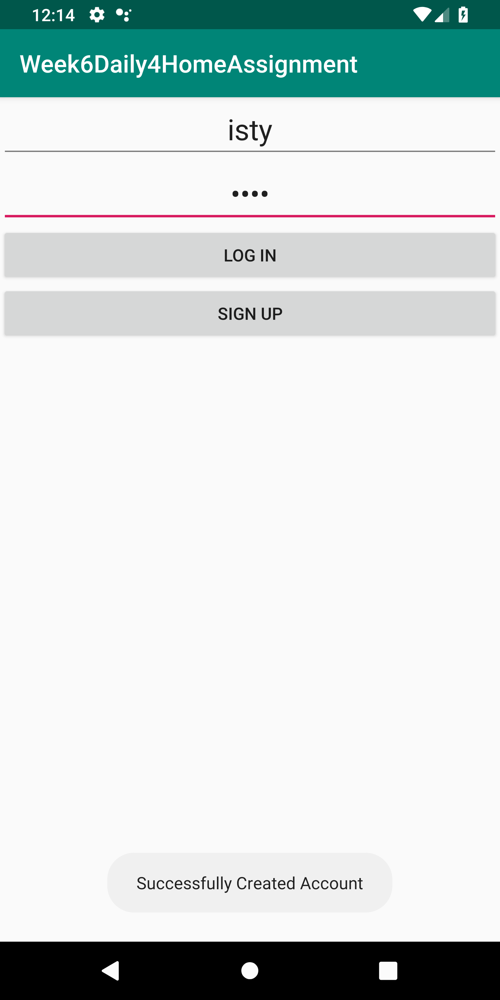

# Week6Daily4HomeAssignment
An UI that allows the user to generate a new account using username and password.  Store the info in a sqldatabase with username and a encrypted password. An UI that will allow the user to signin and go to a new activity upon entering a valid username and password. On the activity for sucessful login, display the actual password and give the user the ability to set a new password

This user haven't sign up yet.

Successfully signed up.

Successfully loggen in. Got the password change feature.

Password changed successfully.

